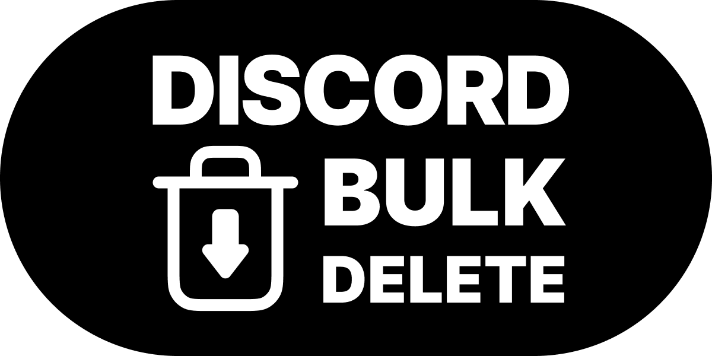
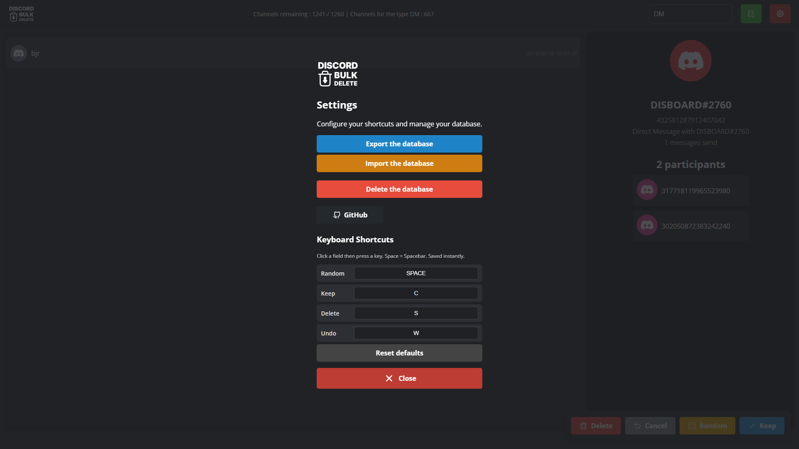

# Discord Bulk Delete

<p align="center">
  
</p>

Local web app (client‑side only) to browse your official Discord data export (ZIP), review channels (Direct Message / Group DM / Guild Text/Voice/Thread) and build a list of conversations you want Discord to remove. Tinder‑style: keep, delete, next.

> I am French and not a pro developer. I built this after needing a clean way to request deletion of old conversations. English wording may not be perfect—sorry! Contributions are very welcome.

---

## Why did I build this?

I wanted to delete messages from many conversations.

I saw two possible paths:

1. Use a browser script/extension like [undiscord](https://github.com/victornpb/undiscord) to mass delete.  
   Problem: this can go against Discord ToS, and for servers where I am banned or already left, I cannot access messages anymore to delete them manually.

2. Use GDPR (EU data protection law).  
   Under GDPR you can request access and deletion of your personal data. Discord lets you download your archive and (in theory) request deletion.

Reality: Discord might ask for a precise, structured list of conversations (channel IDs) you want removed. After [watching this video from an American creator](https://www.youtube.com/watch?v=g5FbRfwMEuo), I decided to build a small tool (with my limited skills) to:
- Import the Discord ZIP
- Quickly classify each conversation (Keep / Delete)
- Export a clean text file listing the conversations I will send to Discord Support for deletion

🟡 I do not know yet if the final deletion request will succeed. I will try. If it works, I will continue expanding the TODO list.

---

## Disclaimer

- This tool does NOT delete anything automatically on Discord.
- It only helps you organize IDs to include in a manual GDPR deletion request.
- Not affiliated with Discord.
- No legal advice. For GDPR details, consult official sources.
- Use responsibly and respect Discord Terms of Service.

---

## Main Features

- Import the official Discord data export ZIP
- Parse user info, channels, messages, attachments
- Random channel picker to process them fast
- Mark channel as Keep or Delete
- Undo last action (history stack)
- Export / Import the internal database (progress backup)
- Participants list for DM / GROUP_DM (with your own ID marked)
- Pagination (load more messages)
- Pure front‑end (no backend server — privacy first)

---

## Screenshots

| Screen | Description |
| ------ | ----------- |
|  | First import dialog |
|  | Cleaning / classification view |
|  | Settings / export & import |

---

## How to Install & Use

1. Request your Discord data export (Account + Messages) from Discord (Settings → Privacy & Safety → Request Data).
2. Wait until Discord emails you the ZIP and download it.
3. Go to the site https://discord-bulk-delete.vercel.app/
4. Click “Import” and select the ZIP.
5. Press “Random” and classify each conversation:
   - Keep
   - Delete (marks for deletion list)
   - Cancel (undo last action)
6. Export the database periodically to save progress.
7. When finished, export (click on the green button on the right corner)
8. Use that list to build a clear GDPR deletion request to Discord.

---

## Simple Data Flow

1. Load ZIP → parse JSON / messages.
2. Store channels/messages in IndexedDB + some info in localStorage.
3. Random selection chooses a pending channel.
4. Move channel to Keep or Delete store.
5. Export DB or Delete DB manually if you restart.

---

## TODO / Roadmap

- [ ] Transform code to use Express.js
- [ ] Rewrite front-end in another framework during Express.js refactor
- [ ] User-friendly progress bar while parsing ZIP
- [ ] Attachment preview enhancements
- [ ] Basic search (by channel ID / message substring)
- [ ] Discord API to fetch avatars / display names (more readable)
- [ ] Settings panel for custom keyboard shortcuts
- [ ] Multilingual UI (EN / FR)
- [ ] Highlight large or old conversations first (prioritization)
- [ ] Better error notifications (non-blocking UI)

---

## Contributing

I am not very good at development. Help is appreciated!

Guidelines:
- Keep it simple (no heavy framework unless justified)
- Clear English (or French) commit messages
- Small PRs easier to review

Basic workflow:
1. Fork repository
2. Create branch: `feat/your-feature`
3. Commit & push
4. Open Pull Request (explain what & why)

---

## FAQ

**Does this upload my data anywhere?**  
No. Everything stays in your browser.

**Can it auto-delete my messages on Discord?**  
No. It only prepares a list.

**I lost progress after closing the browser.**  
Use Export DB regularly and re-import later.

**Will Discord accept the deletion request?**  
Not guaranteed. This tool just helps you organize a precise list.

---

## License
```
MIT License – see LICENSE
```

---

Happy cleaning & good luck with your GDPR request! ✨